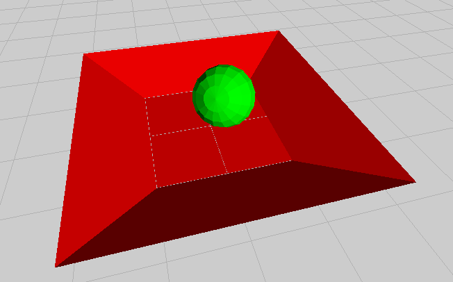

# simple-physx-example
A dead simple PhysX example program

This project creates a polygonal dish and a rigidbody sphere and runs the simulation for 512 ticks.
A detailed explanation here (a lot of this is ripped from the official physx docs):
http://www.b-type.net/px/

